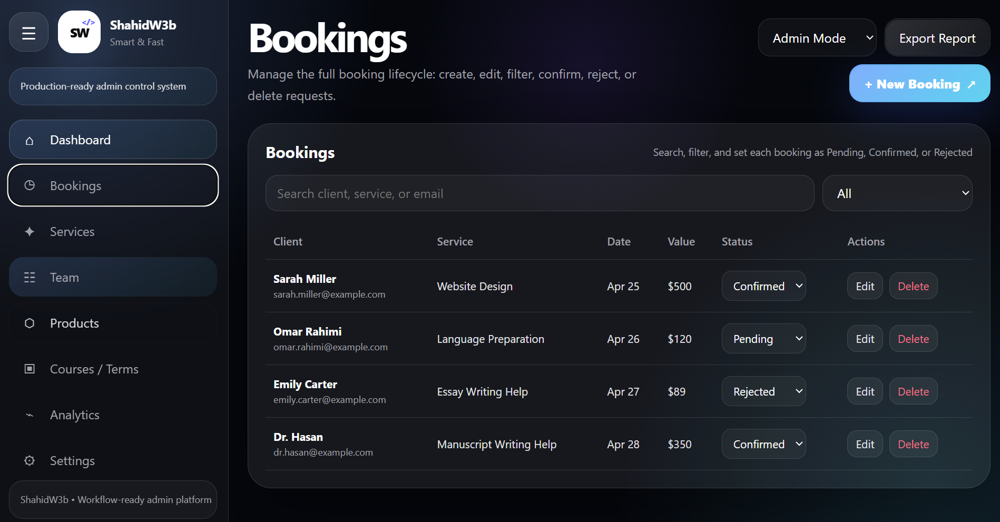

# Admin Dashboard Control Platform

Admin Dashboard is a lightweight, static management platform developed using **HTML, CSS, and JavaScript**, dedicated to managing **client bookings, service workflows, team operations, and analytics** in a unified control system.

The platform presents booking activities, service structures, team responsibilities, product systems, and operational insights, with an emphasis on efficient workflow management, structured service delivery, and scalable dashboard design.

---

## 📸 Preview

<a href="https://client-booking-dashboard-1ur9fk45j-shahabs-projects-654ac3d3.vercel.app/"><strong>➥ Live Demo</strong></a>

---

## ⚙️ Core Functional Areas

The dashboard operates across several primary management domains:

### 📅 Booking Management

* Create, edit, and manage client bookings
* Track request status (Pending, Confirmed, Rejected)
* Search and filter bookings by client, service, or email
* Export booking data for reporting and analysis

### 🧩 Service Management

* Define and organize available services
* Maintain structured service offerings
* Support workflow-based service delivery

### 📦 Product & System Overview

* Showcase active digital products and platforms
* Provide direct access to deployed systems
* Maintain centralized product visibility

### 📊 Analytics & Insights

* Monitor booking trends and service demand
* Track operational performance and revenue estimates
* Visualize workflow pipelines and activity

---

## 🛠️ Technologies Used

This project is intentionally built using **core web technologies** to ensure simplicity, performance, and maintainability.

* **HTML5** – semantic markup
* **CSS3** – responsive, mobile-first layout
* **Vanilla JavaScript** – client-side interactivity

---

## 📱 Features

* Fully responsive, mobile-first dashboard design
* Clean and modern user interface
* Interactive booking and workflow management system
* Role-based interaction (Admin / Viewer modes)
* Local storage-based data persistence
* Export functionality for operational reporting

---

## 📂 Project Structure

/project-root  
├── admin.html  
├── style.css  
└── file.js
